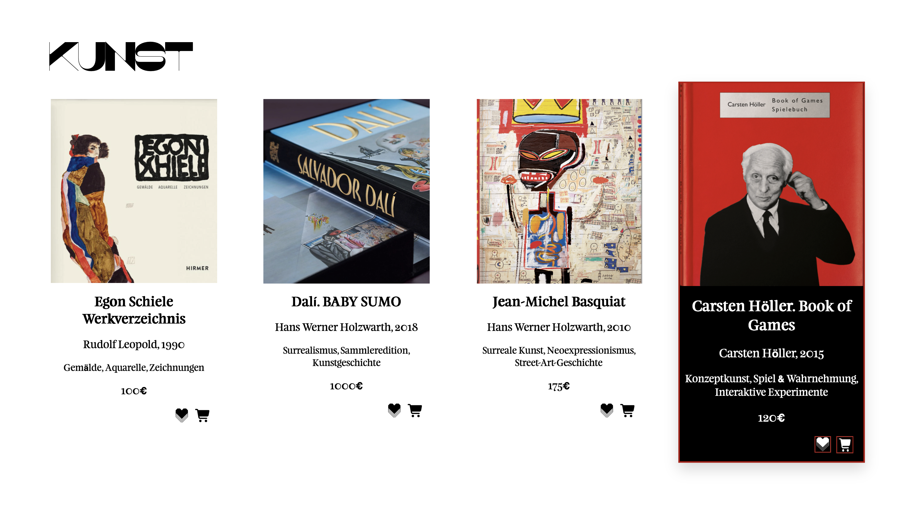
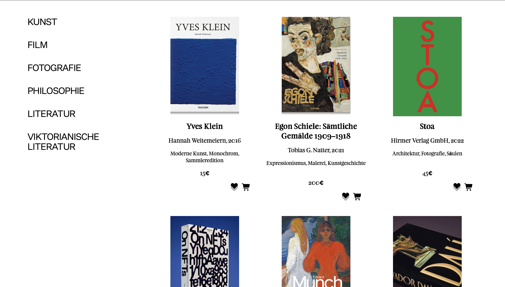

# Online-Buchhandlung abc
Eine moderne und responsive Online-Buchhandlung, entwickelt mit HTML, CSS und JavaScript im Rahmen des Web-Grundlagen-Kurses am Syntax Institut.
Die Anwendung ermöglicht es, Bücher zu entdecken, nach Kategorien zu filtern, Buchdetails anzuzeigen, Bücher zu Favoriten hinzuzufügen und Bücher in den Warenkorb zu legen. 

## Tech Stack
HTML5, CSS3, JavaScript (ES6+), JSON

## Hosting
Vercel

## Kernfeatures
- Übersichtlicher Bücherkatalog
- Dynamische Darstellung der Bücher
- Filterung nach Kategorien
- Detailansicht einzelner Bücher
- Bücher zu Favoriten hinzufügen
- Bücher in den Warenkorb legen
- Pagination
- Responsive Design
- Dynamisches Laden der Buchdaten aus JSON
- Modernes und benutzerfreundliches Design

## Live Demo
[Vercel-Live-demo](https://projekt-1-js-buchhandlung.vercel.app/)

## Screens

